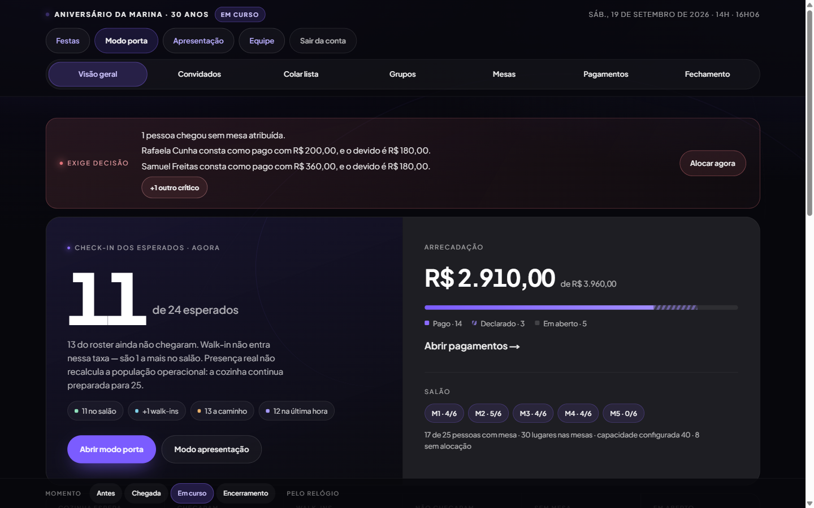
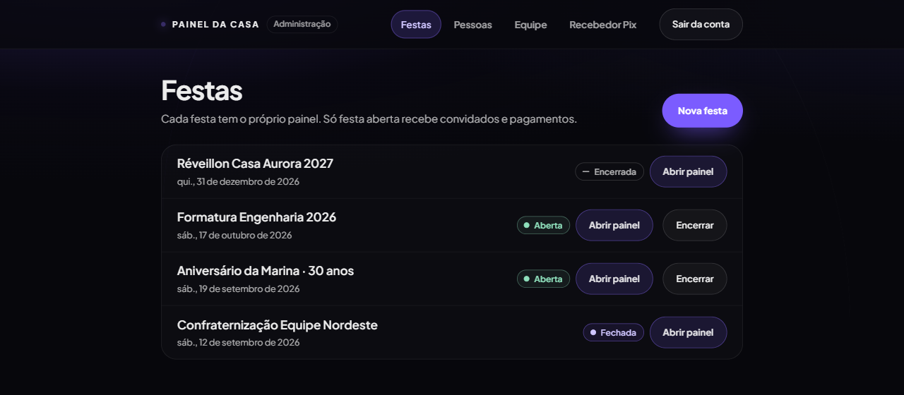
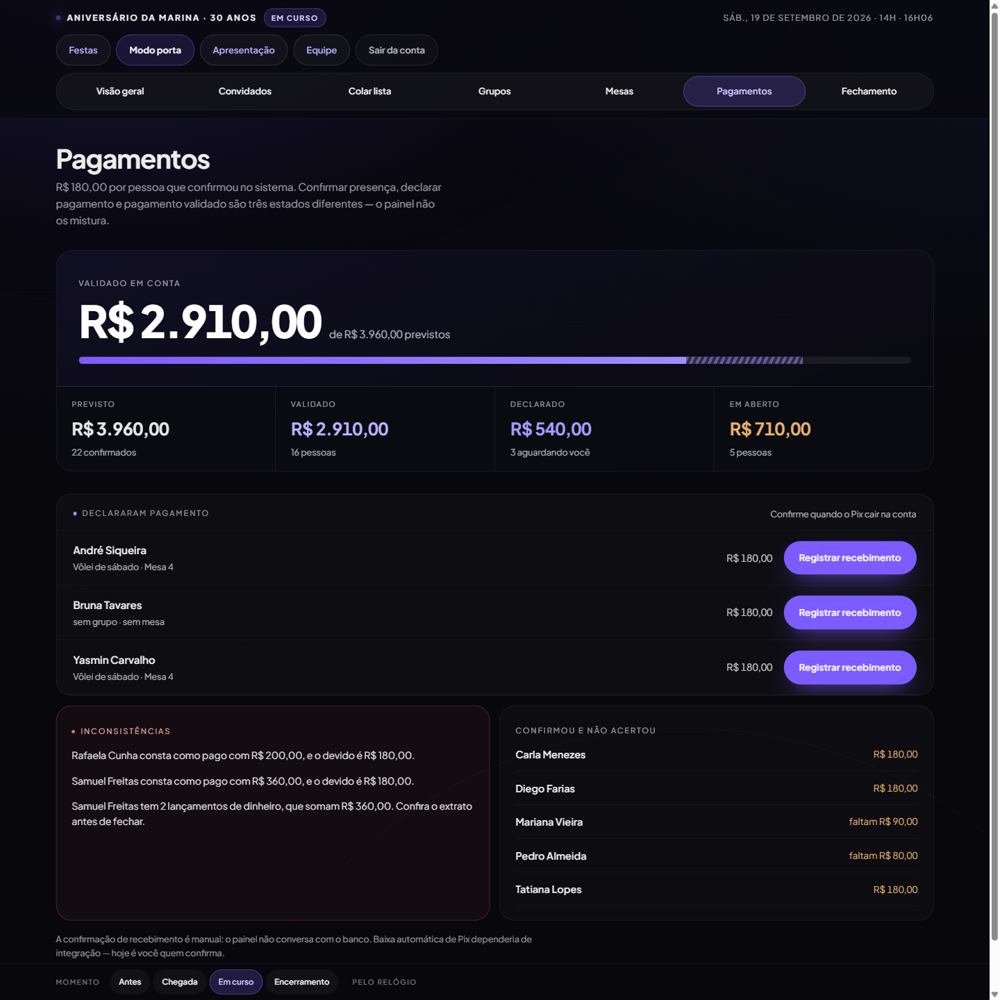
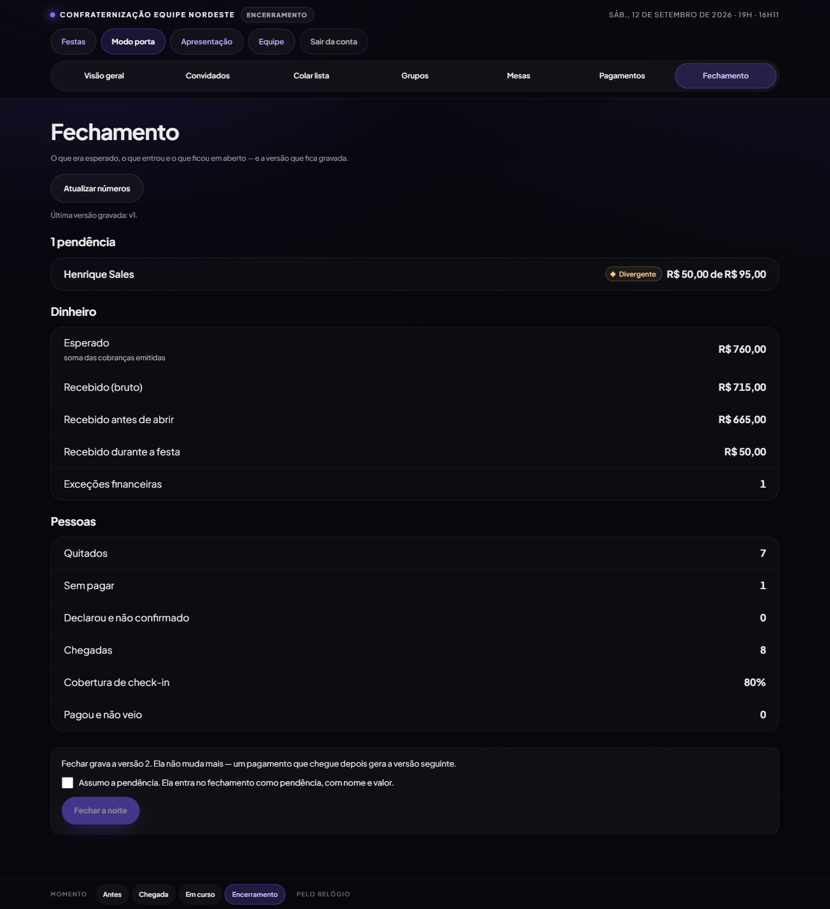
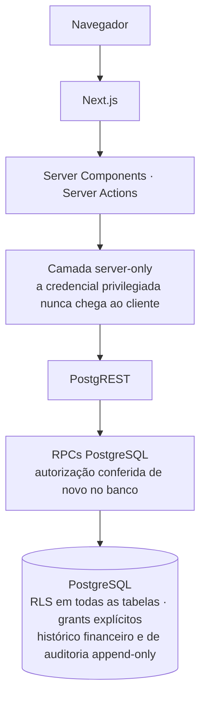
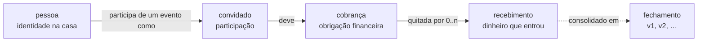

<picture><source media="(max-width: 600px)" srcset="https://github.com/danielsouzaa7/event-operations-os-showcase/raw/master/docs/assets/brand/event-operations-mobile.svg"></picture>

# Event Operations OS

**Sistema operacional para casas de eventos pagos** — convidados, RSVP, Pix, check-in, mesas e fechamento financeiro versionado.

**Commercial V1** — implementação concluída e validada localmente · **ainda não implantado em produção** · código-fonte privado

Next.js 16 · React 19 · TypeScript · PostgreSQL 17 · 1.137 testes unitários

Painel de um evento em andamento — laboratório local, dados fictícios.

---

## O problema

Uma casa que recebe eventos pagos por pessoa — aniversários, jantares de formatura, confraternizações — costuma operar com **WhatsApp, planilhas, lista de convidados, banco, Pix, equipe da porta, mapa de mesas e um fechamento feito à mão**. Cada fonte guarda uma versão diferente da verdade, e elas divergem justamente nos piores momentos:

- alguém **confirmou** e nunca pagou;
- alguém **disse que pagou**, mas o dinheiro não entrou;
- o dinheiro **entrou** — R$ 90 de R$ 180, ou duas vezes;
- alguém **chegou** sem estar na lista, e alguém da lista **não veio**.

Uma semana depois, ninguém sabe dizer qual foi o fechamento real da noite — nem o que mudou depois dele.

**O Event Operations OS mantém esses fatos separados.** Ele nasceu como um sistema privado para operar um evento real (um aniversário com cerca de 50 convidados) e foi generalizado num produto multi-evento para uma casa de eventos e sua equipe: a **Commercial V1**.

## A ideia central

### Confirmou ≠ Declarou pagamento ≠ Pagamento recebido

| Estado | O que significa | Quem afirma |
|---|---|---|
| **Confirmou** | A pessoa informou que vai ao evento. | O convidado (ou a equipe, por outros canais) |
| **Declarou pagamento** | A pessoa informou que fez o Pix. **Não move dinheiro.** | O convidado |
| **Pagamento recebido** | A casa confirmou que o dinheiro realmente entrou. | A casa |

Planilhas reduzem os três a uma única coluna "pago". Aqui são três fatos, com três autores diferentes, e toda tela os mostra lado a lado — *validado*, *declarado*, *em aberto*.

## O que o sistema faz

| Área | Funcionalidade | O que faz |
|---|---|---|
| **Eventos** | Múltiplos eventos | Um painel e um ciclo de vida por evento: `RASCUNHO → ABERTA → ENCERRADA → FECHADA` |
| | Operadores ADMIN / OPERADOR | Contas individuais, cada uma com seu papel |
| | Trilha de auditoria | Ações privilegiadas registradas com autor e resultado |
| **Convidados** | Convidados | Lista montada colando nomes; a mesma pessoa é reconhecida entre eventos |
| | Links individuais | Link pessoal opaco — sem conta, sem senha, sem busca por telefone |
| | RSVP | Pelo link do convidado ou registrado pela equipe |
| | Grupos | Grupos sociais, independentes das mesas |
| | Mesas | Lugares com capacidade e alocação |
| **Dinheiro** | Cobranças Pix | Valor e recebedor congelados na emissão; Pix copia e cola |
| | Declaração de pagamento | O "já paguei" fica registrado — e não conta como dinheiro |
| | Validação manual de recebimento | A equipe registra o que realmente caiu na conta |
| | Pagamento parcial | Continua parcial; o restante continua em aberto |
| | Divergências | Registradas como recebidas e apontadas como pendência no fechamento |
| | Excesso / duplicidade | Ficam visíveis, nunca arredondados para "pago" |
| | Fechamento financeiro versionado | Versões `v1`, `v2`, … imutáveis por evento |
| **Porta** | Modo porta e check-in | Check-in pelo celular, pensado para a entrada |
| | Fila offline | Responde no toque e sincroniza depois; pendente nunca aparece como confirmado |
| | Walk-ins | Criados na porta, já com a própria cobrança |
| **Palco** | Modo palco | Visão para TV ou telão, sem dados pessoais |

## Telas

Todas as telas vêm do **laboratório local descartável**, com **dados fictícios** — casa, nomes e chave Pix inventados (em domínio reservado `.example`).

<table>
  <tr>
    <td width="50%" valign="top">
      
       <b>Eventos</b> — um painel por evento. O estado do ciclo de vida decide o que cada evento ainda aceita.
    </td>
    <td width="50%" valign="top">
      
       <b>Painel operacional</b> — chegadas em relação aos esperados, dinheiro por estado, ocupação das mesas e o que exige decisão.
    </td>
  </tr>
  <tr>
    <td width="50%" valign="top">
      
       <b>Pagamentos e inconsistências</b> — validado, declarado e em aberto nunca se misturam. Pagamento a maior e Pix duplicado de verdade aparecem listados, não absorvidos.
    </td>
    <td width="50%" valign="top">
      
       <b>Fechamento versionado</b> — última versão gravada <code>v1</code>, uma pendência divergente e o que a <code>v2</code> vai registrar.
    </td>
  </tr>
  <tr>
    <td width="50%" valign="top" align="center">
      
       <b>Modo porta no celular</b> — esperados com mesa, grupo e situação do pagamento; um toque por chegada.
    </td>
    <td width="50%" valign="top" align="center">
      
       <b>Registro de recebimento</b> — R$ 90 de uma cobrança de R$ 180 continua parcial. <i>Segundo Pix real</i> e <i>correção</i> são modos separados, sempre com motivo.
    </td>
  </tr>
</table>

## Arquitetura

**Stack:** Next.js 16 · React 19 · TypeScript · PostgreSQL · Supabase / PostgREST.

O navegador nunca fala com o banco. Toda operação privilegiada passa por uma camada que só existe no servidor, e as regras que precisam valer sob concorrência vivem **dentro do PostgreSQL**, em RPCs. A aplicação chama RPCs; ela não escreve diretamente nas tabelas de dinheiro.

- **RLS em todas as tabelas**, com a superfície de permissões declarada explicitamente. Os papéis públicos do Supabase não têm nenhum privilégio de tabela.
- **Histórico append-only:** a aplicação nunca altera nem apaga um registro de dinheiro. Um erro se corrige com um novo lançamento.

### Modelo de domínio

| Conceito | Papel |
|---|---|
| **pessoa** | A identidade da pessoa na casa, entre eventos. Duplicatas podem ser unificadas sem perder o histórico financeiro. |
| **convidado** | A *participação* dessa pessoa em um evento — RSVP, grupo, mesa, chegada, link de acesso. |
| **cobrança** | A obrigação financeira. No máximo uma cobrança viva por participação. |
| **recebimento** | O fato financeiro real: dinheiro que entrou na conta. |
| **fechamento** | Um retrato versionado do dinheiro, das pessoas e das pendências do evento. |

## Modelo financeiro

**Cobrança ≠ recebimento.** A cobrança diz o que é devido; o recebimento diz o que entrou. Nada além disso é fonte de verdade para dinheiro.

- A **cobrança** guarda o **valor**, o **recebedor Pix** e o **estado**. Valor e recebedor ficam **congelados na emissão** — trocar a chave Pix da casa depois não redireciona nem reprecifica uma cobrança já emitida.
- O **recebimento** é dinheiro que realmente entrou na conta, registrado por um operador.
- **A quitação é derivada**, nunca armazenada. A cobrança não tem uma marca de "pago" que possa se desencontrar do dinheiro.

| O que aconteceu | O que o sistema registra |
|---|---|
| O convidado pagou R$ 90 de R$ 180 | Um recebimento de R$ 90. A cobrança continua em aberto — *faltam R$ 90*. |
| O convidado pagou R$ 200 de R$ 180 | Um recebimento de R$ 200, exibido como inconsistência — não é arredondado para "pago". |
| Duplo clique, ou nova tentativa depois de uma resposta perdida | A mesma operação devolve o recebimento já existente. **Nenhum registro novo.** |
| A mesma operação chega com outro valor | **Recusada** — nunca absorvida em silêncio. |
| O Pix foi enviado duas vezes de verdade | Um segundo recebimento, com motivo. **Os dois ficam registrados**, e o fechamento aponta a exceção financeira. |
| O operador digitou o valor errado | Um lançamento de **correção**, com motivo. O original nunca é editado nem apagado. |

Um recebimento só pode ser positivo, a não ser que seja uma correção explícita — regra garantida pelo banco, não pelo formulário.

## Fechamento versionado

Fechar um evento grava a **versão N** dos seus números e o leva ao estado `FECHADA`. Um evento fechado recusa mudanças operacionais — convidados, RSVP, check-in —, mas **o dinheiro continua entrando**, porque dinheiro atrasado também é real. Ele nunca edita um fechamento existente:

| Quando | O que acontece | Fechamentos gravados |
|---|---|---|
| Na noite do evento | A equipe fecha o evento → `FECHADA` | `v1` |
| Dois dias depois | Entra um Pix atrasado, registrado como recebimento | `v1` — **intacta** |
| No mesmo dia | A equipe fecha de novo | `v1` (intacta) · `v2` (novo estado) |

É deliberado: **fica preservado o que a casa sabia, e quando.** Cada versão é única por evento, e a aplicação não tem permissão para alterar nem apagar um fechamento.

## Concorrência e consistência

As corridas são resolvidas pelo PostgreSQL e exercitadas contra um Postgres real na suíte de integração — com a sobreposição *construída* entre duas sessões de banco, e não apenas esperada de chamadas em paralelo.

- **Locks no PostgreSQL.** As operações de dinheiro travam a cobrança *antes* de ler quanto já foi recebido, então dois operadores confirmando ao mesmo tempo não conseguem ambos ver "não pago".
- **Idempotência.** Cada recebimento carrega uma chave de idempotência: duplo clique ou nova tentativa de rede viram um único efeito.
- **Índices únicos.** No máximo uma cobrança viva por participação, e uma participação por pessoa em cada evento.
- **Autorização transacional.** Papel e situação da conta são conferidos no banco, na mesma transação da escrita.
- **Proteção contra corridas administrativas.** Desativações em paralelo não deixam a casa sem um ADMIN ativo, e o token de criação do primeiro ADMIN só pode ser usado uma vez.

## Segurança

Estão listadas apenas capacidades verificadas pelas suítes de teste.

- **Contas individuais** de operador, com papéis **ADMIN** / **OPERADOR**.
- **Sessões revogáveis:** sair ou desativar uma conta invalida as sessões dela na hora.
- **Links opacos para convidados:** um link desconhecido nunca é identificado como desconhecido, então a lista de convidados não pode ser sondada.
- **Sem busca pública por telefone:** nenhum endpoint revela ou reivindica um convidado a partir de um número.
- **RLS** em todas as tabelas e **grants explícitos**.
- **Trilha de auditoria** append-only: quem fez o quê, incluindo o resultado.
- **Acesso privilegiado somente no servidor:** a credencial de serviço nunca chega ao navegador.
- **Senhas protegidas no banco:** os hashes ficam inacessíveis ao papel da aplicação, e a verificação tem atraso progressivo por usuário.

**Transparência:** ainda não houve pentest externo, ainda não há Content-Security-Policy, e o sistema ainda não foi implantado em produção.

## Validação

| Camada | Resultado | O que cobre |
|---|:---:|---|
| **Testes unitários** | **1137 / 1137** | Derivações financeiras e de público, server actions, sessões, Pix copia e cola, contratos de interface |
| **Verificações de migrations** | **649 / 649** | Todas as migrations em Postgres: RPCs, permissões, RLS, restrições |
| **Integração** | **50 / 50** | PostgreSQL 17 + PostgREST reais — papéis, RLS, permissões, concorrência, isolamento entre eventos |
| **Aceitação** | **25 / 25** | Ponta a ponta pelas ações do produto — 10 cenários, de um evento novo até a noite fechada |
| **Concorrência** | **PASS** | Corridas de dinheiro, de último ADMIN e de unificação de pessoas em Postgres real |
| **TypeScript** | **PASS** | Verificação de tipos |
| **ESLint** | **PASS** | Lint |
| **Build de produção** | **PASS** | Build do Next.js |

Integração e aceitação rodam em **PostgreSQL e PostgREST reais**, num **laboratório local descartável** que reproduz a configuração de papéis do Supabase. Testes destrutivos só rodam ali: o harness valida o destino antes de operar e **falha fechado** diante de qualquer destino não autorizado, exige um banco vazio para começar e confere que a limpeza realmente aconteceu.

## Limitações conhecidas

- **A confirmação de pagamento é manual** — não há integração com banco ou PSP, e a interface deixa isso claro.
- **Interface em português** e **fuso horário único**.
- **Recuperar o acesso quando só existe um ADMIN exige intervenção técnica** — o recomendado é manter duas contas ADMIN.
- **Ainda sem Content-Security-Policy.**
- **O deploy de produção exige um plano próprio**, com migração e ensaio dedicados.

## Status do projeto

| | |
|---|---|
| **Versão** | Commercial V1 |
| **Implementação** | Concluída |
| **Gate local** | Aprovado |
| **Deploy de produção** | Ainda não realizado |
| **Código-fonte** | Privado — software comercial proprietário |

---

© 2026 Daniel Souza Valerio. Todos os direitos reservados. Este repositório apresenta o produto; o código-fonte não é público.
